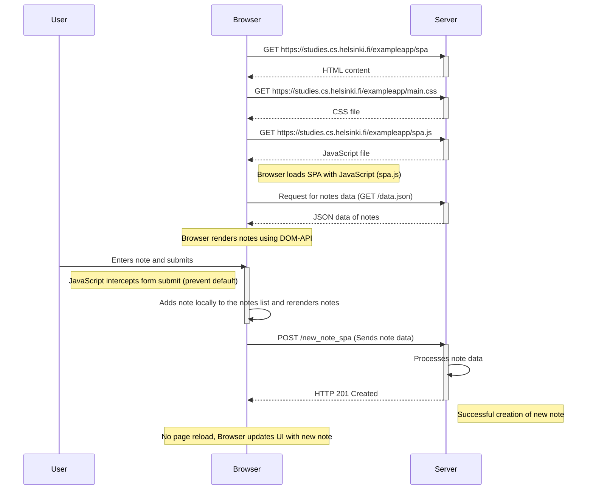

```mermaid
sequenceDiagram
    participant User
    participant Browser
    participant Server

    Browser->>Server: GET https://studies.cs.helsinki.fi/exampleapp/spa
    activate Server
    Server-->>Browser: HTML content
    deactivate Server

    Browser->>Server: GET https://studies.cs.helsinki.fi/exampleapp/main.css
    activate Server
    Server-->>Browser: CSS file
    deactivate Server
    
    Browser->>Server: GET https://studies.cs.helsinki.fi/exampleapp/spa.js
    activate Server
    Server-->>Browser: JavaScript file
    deactivate Server
    Note right of Browser: Browser loads SPA with JavaScript (spa.js)

    Browser->>Server: Request for notes data (GET /data.json)
    activate Server
    Server-->>Browser: JSON data of notes
    deactivate Server
    Note over Browser: Browser renders notes using DOM-API

    User->>Browser: Enters note and submits
    activate Browser
    Note left of Browser: JavaScript intercepts form submit (prevent default)
    Browser->>Browser: Adds note locally to the notes list and rerenders notes
    deactivate Browser

    Browser->>Server: POST /new_note_spa (Sends note data)
    activate Server
    Server->>Server: Processes note data
    Server-->>Browser: HTTP 201 Created
    deactivate Server
    Note right of Server: Successful creation of new note

    Note over Browser: No page reload, Browser updates UI with new note
```